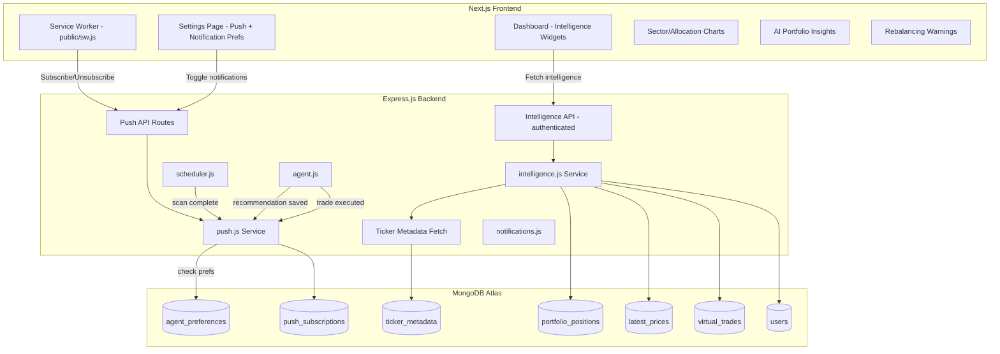
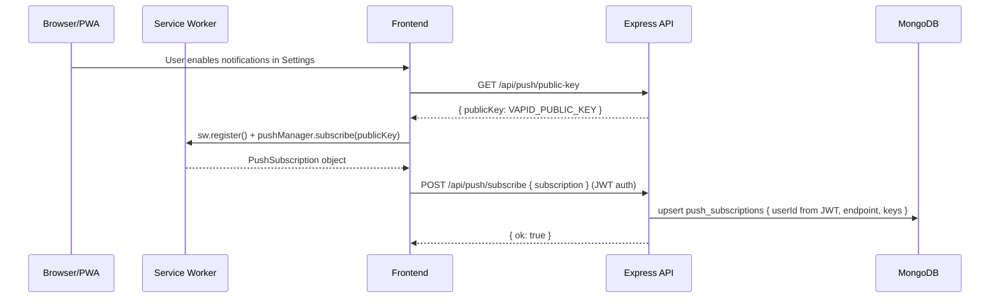
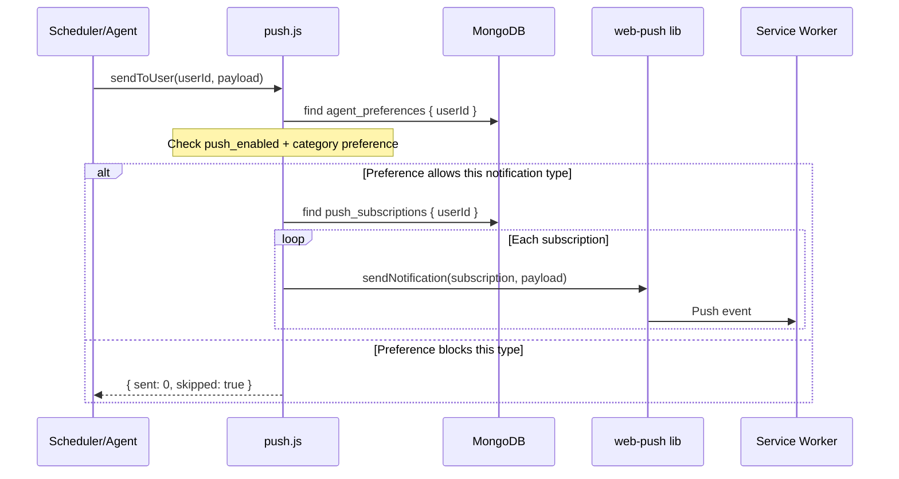
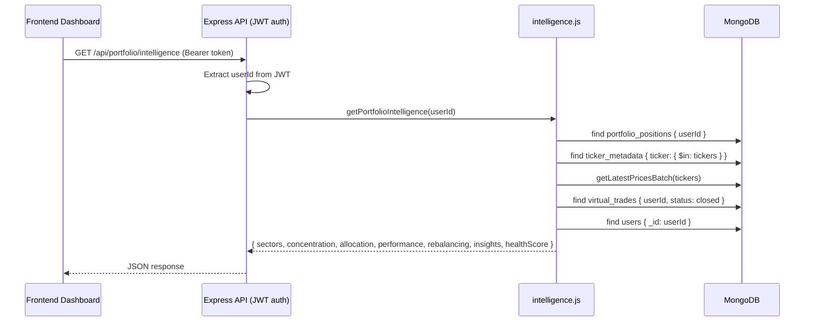

# Design Document: Push Notifications & Portfolio Intelligence

## Overview

This feature adds two complementary capabilities to StockSense: (1) a Web Push notification system that delivers real-time alerts when the agent generates recommendations, executes trades, or when signals expire; and (2) an Advanced Portfolio Intelligence engine that computes sector exposure, concentration risk, allocation analysis, performance metrics, AI-generated insights, and rebalancing warnings.

The push system leverages the existing `web-push` package and `push_subscriptions` collection, using VAPID keys from environment variables. Push notifications respect user notification preferences stored in `agent_preferences`. The portfolio intelligence system uses a new `ticker_metadata` collection for sector data, aggregating it with `portfolio_positions`, `virtual_trades`, and `latest_prices` into a single authenticated analytics endpoint.

Both features integrate into the existing Express.js backend at `backend/services/` level and the Next.js frontend component tree without introducing new directories.

## Architecture



## Sequence Diagrams

### Push Notification Subscription Flow



### Push Notification Delivery Flow (with preference check)



### Portfolio Intelligence Flow (authenticated)



## Components and Interfaces

### Component 1: Push Notification Service (`backend/services/push.js`)

**Purpose**: Manages VAPID configuration, respects user notification preferences, sends push notifications to individual users. Handles subscription cleanup on delivery failure.

**Interface**:
```javascript
export function initPush()
export function getPublicKey()
export async function subscribe(userId, subscription)
export async function unsubscribe(userId, endpoint)
export async function sendToUser(userId, { title, body, url, entityId, tag, type })
```

**Notification Types and Default Preferences**:
```javascript
// Types mapped to preference keys:
// 'recommendation' → notify_recommendations (default: true)
// 'execution'      → notify_executions (default: true)
// 'rebalancing'    → notify_rebalancing (default: true)
// 'scan_complete'  → notify_scans (default: false)
```

**Payload Format with Deep Links**:
```javascript
{
  title: "BUY AAPL",
  body: "Confidence 87% — Above 200DMA, positive sentiment",
  url: "/actions",
  entityId: "6a22ba97...",  // recommendation _id for deep link
  tag: "rec-AAPL",         // prevents duplicate notifications
  type: "recommendation"   // used for preference filtering
}
```

### Component 2: Ticker Metadata Service (`backend/services/metadata.js`)

**Purpose**: Fetches and caches sector/industry data for tickers using Twelve Data company profile endpoint. Stores in `ticker_metadata` collection with TTL refresh.

**Interface**:
```javascript
export async function getTickerMetadata(ticker)
export async function getMetadataBatch(tickers)
export async function refreshMetadata(ticker)
```

**Collection**: `ticker_metadata`
```javascript
{
  ticker: "AAPL",
  name: "Apple Inc",
  sector: "Technology",
  industry: "Consumer Electronics",
  exchange: "NASDAQ",
  updated_at: Date
}
```

### Component 3: Portfolio Intelligence Service (`backend/services/intelligence.js`)

**Purpose**: Computes portfolio analytics. Uses ticker_metadata for sector data. Health score formula weighted toward portfolio quality (not trading performance).

**Interface**:
```javascript
export async function getPortfolioIntelligence(userId)
```

**Health Score Formula (revised)**:
- 40% Diversification (number of positions, HHI inverse)
- 30% Concentration safety (inverse of max single-position weight)
- 20% Cash allocation adequacy (penalize <5% or >50% cash)
- 10% Sector balance (penalize single-sector dominance)

**Rebalancing Logic (V1 — warnings only)**:
Instead of calculating target allocations, generate warnings:
```javascript
// Only generate when:
// - Single sector > 45% of equity
// - Single position > 35% of equity
// - Cash < 5% of total
// - Cash > 60% of total

// Output format:
{ type: 'warning', message: 'Technology exposure high (52%)', severity: 'high' }
{ type: 'warning', message: 'NVDA represents 38% of portfolio', severity: 'medium' }
{ type: 'info', message: 'Cash reserves adequate at 22%', severity: 'low' }
```

**AI Portfolio Insights** (generated via Gemini on-demand):
```javascript
// Generated dynamically:
[
  "Your portfolio is heavily concentrated in Technology (52%)",
  "AAPL contributes 45% of unrealized gains",
  "Cash at 15% provides moderate downside buffer",
  "No Healthcare or Energy exposure — limited diversification"
]
```

### Component 4: Service Worker (`public/sw.js`)

**Notification Click Behavior** (with entityId deep links):
```javascript
// On notification click:
// - If url = "/actions" and entityId present → open /actions?highlight=entityId
// - If url = "/trades" → open /trades
// - Default → open /dashboard
```

### Component 5: Notification Preferences (in `agent_preferences`)

**Extended Schema**:
```javascript
// Added to existing agent_preferences document:
{
  push_enabled: true,
  notify_recommendations: true,   // HIGH priority — on by default
  notify_executions: true,        // HIGH priority — on by default
  notify_rebalancing: true,       // MEDIUM priority — on by default
  notify_scans: false,            // LOW priority — off by default
}
```

### Component 6: Frontend Dashboard Widgets

**New components**:
- `PortfolioHealthCard.jsx` — Score 0-100 with color gradient + top insights
- `RebalancingWidget.jsx` — Warning cards with severity badges
- `PortfolioInsights.jsx` — AI-generated text insights

**Dashboard layout additions**:
```
┌─────────────────────────────────┐
│ Metrics Strip (existing)         │
├──────────┬──────────────────────┤
│ Health   │ Sector Chart         │
│ Score    │ (Pie)                │
├──────────┴──────────────────────┤
│ Concentration Risk Alerts        │
├─────────────────────────────────┤
│ Portfolio Insights (AI text)     │
├─────────────────────────────────┤
│ Rebalancing Warnings             │
└─────────────────────────────────┘
```

## Data Models

### PushSubscription Document

```javascript
// push_subscriptions collection (existing)
{
  userId: String,
  endpoint: String,           // HTTPS only
  keys: { p256dh: String, auth: String },
  created_at: Date,
  user_agent: String|null
}
// Index: { userId: 1, endpoint: 1 } unique
```

### Ticker Metadata Document (NEW collection)

```javascript
// ticker_metadata collection
{
  ticker: String,             // e.g. "AAPL"
  name: String,               // "Apple Inc"
  sector: String,             // "Technology"
  industry: String,           // "Consumer Electronics"
  exchange: String,           // "NASDAQ"
  updated_at: Date            // refresh if older than 7 days
}
// Index: { ticker: 1 } unique
```

### Extended agent_preferences (notification prefs)

```javascript
// Added fields to existing agent_preferences:
{
  push_enabled: Boolean,            // default: true
  notify_recommendations: Boolean,  // default: true
  notify_executions: Boolean,       // default: true
  notify_rebalancing: Boolean,      // default: true
  notify_scans: Boolean,            // default: false
}
```

### Intelligence Report Response Shape

```javascript
{
  healthScore: 72,        // 0-100
  sectors: [
    { sector: "Technology", value: 15000, weight: 0.45, positionCount: 3 }
  ],
  concentration: {
    hasRisk: true,
    alerts: [{ ticker: "AAPL", weight: 0.35, level: "critical" }],
    herfindahlIndex: 0.22
  },
  allocation: {
    cashWeight: 0.30,
    equityWeight: 0.70,
    diversificationScore: 65,
    positionCount: 5
  },
  performance: {
    totalReturn: 2500,
    totalReturnPct: 2.5,
    winRate: 68.5,
    bestPerformer: "NVDA",
    bestPerformerPct: 15.3,
    worstPerformer: "META",
    worstPerformerPct: -4.2
  },
  warnings: [
    { type: "warning", message: "Technology exposure high (45%)", severity: "high" },
    { type: "info", message: "Cash reserves adequate at 30%", severity: "low" }
  ],
  insights: [
    "Your portfolio is heavily concentrated in Technology",
    "NVDA contributes 42% of portfolio gains",
    "No Healthcare exposure — limited diversification"
  ]
}
```

## Algorithmic Pseudocode

### Push Notification Delivery (with preference filtering)

```javascript
async function sendToUser(userId, { title, body, url, entityId, tag, type }) {
  // 1. Check user preferences
  const prefs = await db.agent_preferences.findOne({ userId })
  if (!prefs?.push_enabled) return { sent: 0, skipped: true }

  const prefKey = {
    recommendation: 'notify_recommendations',
    execution: 'notify_executions',
    rebalancing: 'notify_rebalancing',
    scan_complete: 'notify_scans',
  }[type]
  if (prefKey && prefs[prefKey] === false) return { sent: 0, skipped: true }

  // 2. Get subscriptions
  const subs = await db.push_subscriptions.find({ userId }).toArray()
  if (!subs.length) return { sent: 0, failed: 0 }

  // 3. Send to all devices
  const payload = JSON.stringify({ title, body, url, entityId, tag })
  let sent = 0, failed = 0
  const toRemove = []

  for (const sub of subs) {
    try {
      await webpush.sendNotification({ endpoint: sub.endpoint, keys: sub.keys }, payload)
      sent++
    } catch (err) {
      failed++
      if (err.statusCode === 410 || err.statusCode === 404) toRemove.push(sub.endpoint)
    }
  }

  if (toRemove.length) await db.push_subscriptions.deleteMany({ userId, endpoint: { $in: toRemove } })
  return { sent, failed }
}
```

### Portfolio Health Score (revised — no win rate dependency)

```javascript
function calculateHealthScore(allocation, concentration, cashWeight, sectorBalance) {
  // Diversification: 40% — based on position count and HHI
  // Ideal: 5+ positions, HHI < 0.2
  const divScore = allocation.diversificationScore // 0-100

  // Concentration safety: 30% — inverse of max position weight
  const concScore = Math.round((1 - concentration.herfindahlIndex) * 100)

  // Cash adequacy: 20% — penalize extremes (<5% or >50%)
  let cashScore = 100
  if (cashWeight < 0.05) cashScore = 30         // too little cash
  else if (cashWeight > 0.50) cashScore = 50    // too much cash (idle capital)
  else if (cashWeight >= 0.10 && cashWeight <= 0.30) cashScore = 100  // ideal
  else cashScore = 70  // acceptable

  // Sector balance: 10% — penalize single-sector dominance >50%
  const sectorScore = sectorBalance > 0.50 ? 30 : sectorBalance > 0.35 ? 60 : 100

  return Math.max(0, Math.min(100, Math.round(
    divScore * 0.40 + concScore * 0.30 + cashScore * 0.20 + sectorScore * 0.10
  )))
}
```

### Rebalancing Warnings (V1 — warnings only, no target calculation)

```javascript
function generateWarnings(sectors, positions, totalEquity, cashWeight) {
  const warnings = []

  // Sector warnings (>45% is high, >60% is critical)
  for (const s of sectors) {
    if (s.weight > 0.60) warnings.push({ type: 'warning', message: `${s.sector} exposure critical (${Math.round(s.weight*100)}%)`, severity: 'critical' })
    else if (s.weight > 0.45) warnings.push({ type: 'warning', message: `${s.sector} exposure high (${Math.round(s.weight*100)}%)`, severity: 'high' })
  }

  // Position warnings (>35% is critical, >20% is warning)
  for (const p of positions) {
    const weight = p.value / totalEquity
    if (weight > 0.35) warnings.push({ type: 'warning', message: `${p.ticker} represents ${Math.round(weight*100)}% of portfolio`, severity: 'high' })
  }

  // Cash warnings
  if (cashWeight < 0.05) warnings.push({ type: 'warning', message: 'Cash reserves critically low (<5%)', severity: 'high' })
  else if (cashWeight > 0.60) warnings.push({ type: 'info', message: `High cash position (${Math.round(cashWeight*100)}%) — capital may be underutilized`, severity: 'medium' })
  else warnings.push({ type: 'info', message: `Cash reserves adequate at ${Math.round(cashWeight*100)}%`, severity: 'low' })

  return warnings
}
```

## Key Functions with Formal Specifications

### Function 1: `sendToUser(userId, payload)`

**Preconditions:**
- `initPush()` has been called
- `userId` is non-empty string
- `payload.title` and `payload.body` are non-empty strings
- `payload.type` is one of: recommendation, execution, rebalancing, scan_complete

**Postconditions:**
- If user preferences block this type: returns `{ sent: 0, skipped: true }`
- Otherwise: `sent + failed === total subscriptions`
- Expired subscriptions (410/404) removed from DB
- Never throws — failures captured in return value

### Function 2: `getPortfolioIntelligence(userId)`

**Preconditions:**
- `userId` is non-empty string
- MongoDB connection available

**Postconditions:**
- Returns complete report even if portfolio is empty (zeroed values)
- `healthScore` is integer 0-100
- sector weights sum to ≈ 1.0 when positions exist
- Does not mutate database state (read-only)
- Uses ticker_metadata for sector data; falls back to 'Unknown' if not available

### Function 3: `getTickerMetadata(ticker)` / `getMetadataBatch(tickers)`

**Preconditions:**
- ticker(s) are non-empty uppercase strings

**Postconditions:**
- Returns cached metadata if updated_at < 7 days ago
- Fetches from Twelve Data if stale/missing
- On API failure: returns `{ ticker, sector: 'Unknown', ... }`
- Never blocks the intelligence report (graceful degradation)

## Correctness Properties

### Property 1: Delivery Completeness
∀ userId, payload where preferences allow: sendToUser(userId, payload).sent + sendToUser(userId, payload).failed === countSubscriptions(userId). Every subscription gets exactly one delivery attempt.

### Property 2: Preference Enforcement
∀ notification with type T: if user preference for T is false, sendToUser returns { sent: 0, skipped: true }. User preferences are always respected.

### Property 3: Subscription Cleanup
∀ subscription returning statusCode 410 or 404: subscription is deleted from push_subscriptions after sendToUser completes.

### Property 4: Weight Consistency
∀ userId with positions: getPortfolioIntelligence(userId).sectors.reduce(sum, weight) ≈ 1.0 (±0.001).

### Property 5: Concentration Detection
∀ position with weight > 0.20: position appears in concentration.alerts.

### Property 6: Health Score Bounds
∀ report: 0 ≤ healthScore ≤ 100 regardless of portfolio state (empty, single stock, fully diversified).

### Property 7: Health Score Independence from Trades
A new user with positions but zero trades still gets a meaningful health score (based on diversification, concentration, cash, sector balance — NOT win rate).

### Property 8: Rebalancing Coverage
∀ sector with weight > 0.45: a warning with severity 'high' or 'critical' exists in the warnings array.

## Error Handling

### Error Scenario 1: VAPID Keys Not Configured
**Response**: `initPush()` logs warning; `sendToUser` returns `{ sent: 0, failed: 0 }` without throwing.

### Error Scenario 2: Push Subscription Expired (410 Gone)
**Response**: Remove from DB during delivery loop. User re-subscribes on next app open.

### Error Scenario 3: No Portfolio Positions
**Response**: Return zeroed report: healthScore=50, empty sectors, no warnings. Valid empty state.

### Error Scenario 4: Ticker Metadata Unavailable
**Response**: Use 'Unknown' sector. Intelligence report still generated with available data.

### Error Scenario 5: Twelve Data API Failure for Metadata
**Response**: Fall back to cached data (even if stale). If no cache exists, use 'Unknown'.

### Error Scenario 6: Notification Permission Denied
**Response**: Frontend shows "Notifications blocked" in settings. Subscribe button disabled.

## Performance Considerations

- **Intelligence endpoint**: Batch MongoDB queries (positions, prices, trades, metadata in parallel). No N+1.
- **Push delivery**: Fire-and-forget after in-app notification created. Never blocks scan pipeline.
- **Ticker metadata**: Cached 7 days. Fetched on first intelligence request per ticker. Minimal API calls.
- **Service worker**: Minimal payload (title + body + url + entityId). Heavy data fetched on click.

## Security Considerations

- **Intelligence endpoint**: Authenticated via JWT. UserId derived from token, not query param.
- **Push endpoints**: subscribe/unsubscribe authenticated. UserId from JWT.
- **VAPID keys**: Private key never exposed to client.
- **Subscription validation**: Endpoint must be HTTPS.

## Dependencies

- `web-push` ^3.5.0 (already installed)
- `node-cron` 3.0.3 (already installed)
- No new backend dependencies
- Frontend: No new packages
- **One new collection**: `ticker_metadata` (sector/industry cache from Twelve Data)

## Testing Strategy

### Unit Tests
- `calculateHealthScore`: boundary values (empty portfolio → 50, single stock → low, diversified → high)
- `generateWarnings`: sector >45%, position >35%, cash <5%, cash >60%
- `sendToUser`: mock web-push (success, 410 cleanup, preference blocked)
- `getMetadataBatch`: cache hit, cache miss, API failure fallback

### Integration Tests
- Push flow: subscribe → trigger recommendation → verify delivery (mock endpoint)
- Intelligence: seed portfolio → call API → validate schema completeness
- Preference enforcement: disable category → verify notification skipped

### Manual Verification
- Enable push in browser → run agent scan → verify notification appears
- Check intelligence dashboard renders with real portfolio data
- Verify deep link navigation from notification click

