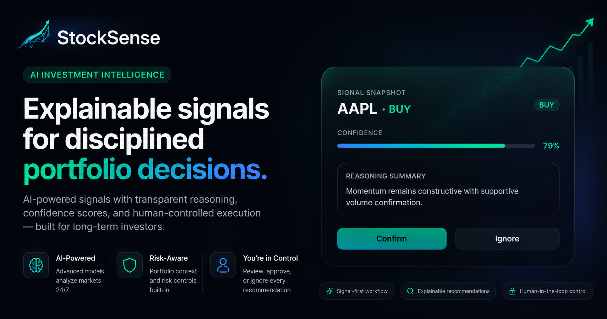

<h1 align="center">StockSense AI</h1>

<p align="center">
  <strong>Personal Investment Operations Agent</strong>
</p>

<p align="center">
  Explainable AI investment intelligence with portfolio-aware signals, transparent reasoning, continuous monitoring, and human-controlled decisions.
</p>

<p align="center">
  
</p>

<p align="center">
  
  
  
  
  
  
  
  
  
</p>


---

# Overview

StockSense AI is a portfolio-aware investment intelligence platform designed to help investors make more informed decisions through explainable AI recommendations, real-time monitoring, and contextual market analysis.

Unlike traditional stock screeners that only surface opportunities, StockSense continuously monitors portfolios and watchlists, evaluates market conditions, generates explainable signals, and keeps investors informed while maintaining full human control over every decision.

The platform is intentionally designed as an **Investment Operations Agent**, not a chatbot.

---

# Core Philosophy

StockSense follows five principles:

- Explainability over black-box recommendations
- Human-controlled decision making
- Portfolio-aware intelligence
- Continuous monitoring instead of manual screening
- Transparency around risk and uncertainty

Every recommendation includes:

- Recommendation type
- Confidence score
- Supporting reasoning
- Portfolio context
- Risk considerations
- Timestamped signal generation

---

# Key Features

## Portfolio-Aware Intelligence

Recommendations are generated using:

- Existing portfolio positions
- Position concentration
- Sector exposure
- Watchlist activity
- Historical recommendation outcomes
- Market conditions

---

## Explainable Signals

Every signal contains:

- Buy / Sell / Hold recommendation
- Confidence score
- Supporting factors
- Risk factors
- Portfolio impact analysis

No recommendation is presented without reasoning.

---

## Watchlist Monitoring

Continuously monitor:

- User watchlists
- Price movements
- Significant changes
- Emerging opportunities
- Risk events

---

## Recommendation Learning Loop

StockSense records user feedback and recommendation outcomes to improve future recommendation quality.

The system tracks:

- Accepted recommendations
- Ignored recommendations
- Dismissed recommendations
- Recommendation performance

---

## Real-Time Market Data

Powered by Twelve Data.

Features include:

- Real-time pricing
- Live updates
- Market context retrieval
- Historical price analysis on demand

---

## Push Notifications

Receive alerts for:

- New recommendations
- Watchlist activity
- Important market events
- Agent-generated signals

---

## Virtual Portfolio

Track performance without executing real trades.

Includes:

- Position tracking
- Portfolio valuation
- P&L monitoring
- Allocation visibility

---

# Architecture

```text
                    ┌─────────────────────┐
                    │     Next.js PWA     │
                    │   Frontend Client   │
                    └──────────┬──────────┘
                               │
                               ▼
                    ┌─────────────────────┐
                    │     Express API     │
                    │     Backend Core    │
                    └──────────┬──────────┘
                               │
         ┌─────────────────────┼─────────────────────┐
         ▼                     ▼                     ▼

 ┌──────────────┐    ┌─────────────────┐   ┌─────────────────┐
 │ MongoDB MCP  │    │ Gemini Agents   │   │ Twelve Data API │
 │ Memory Layer │    │ Reasoning Layer │   │ Market Data     │
 └──────────────┘    └─────────────────┘   └─────────────────┘
```

---

# Technology Stack

## Frontend

- Next.js 15
- React
- Tailwind CSS
- Progressive Web App (PWA)
- Server-Sent Events (SSE)

## Backend

- Express.js
- Node.js

## Database

- MongoDB Atlas
- MongoDB MCP

## AI Layer

- Gemini
- Google Agent Builder

## Market Data

- Twelve Data API
- Twelve Data WebSocket

## Notifications

- Web Push API

---

# Database Design

Core collections:

```text
users
watchlists
watchlist_items
portfolio_positions
latest_prices
recommendation_log
push_subscriptions
```

---

# Real-Time Data Flow

```text
Twelve Data WebSocket
          │
          ▼
     Express API
          │
          ▼
    latest_prices
          │
          ▼
     SSE Stream
          │
          ▼
       Dashboard
```

Historical market candles are not stored.

Historical data is fetched on demand through dedicated pricing tools.

---

# AI Agent Capabilities

The agent can:

- Monitor watchlists
- Analyze portfolios
- Evaluate risk exposure
- Generate recommendations
- Explain recommendations
- Learn from feedback
- Provide market context
- Surface emerging opportunities

---

# Recommendation Lifecycle

```text
Market Data
      │
      ▼
Signal Generation
      │
      ▼
Portfolio Analysis
      │
      ▼
Risk Evaluation
      │
      ▼
Recommendation Creation
      │
      ▼
User Review
      │
 ┌────┴────┐
 ▼         ▼

Accept   Ignore
 │         │
 ▼         ▼

Feedback Logged
      │
      ▼
Learning Loop
```

---

# Project Structure

```text
stocksense/

├── frontend/
├── backend/
├── stocksense-mcp/
└── README.md
└── LICENSE
```

---

# Local Development

## Clone Repository

```bash
git clone https://github.com/AaronKurian/StockSense.git
cd stocksense
```

## Frontend

```bash
cd frontend

npm install
npm run dev
```

## Backend

```bash
cd backend

npm install
npm run dev
```

---

# Environment Variables

Frontend:

```env
NEXT_PUBLIC_API_URL=
NEXT_PUBLIC_SITE_URL=
```

Backend:

```env
MONGODB_URI=
GEMINI_API_KEY=
TWELVE_DATA_API_KEY=
JWT_SECRET=
VAPID_PUBLIC_KEY=
VAPID_PRIVATE_KEY=
```

---

# Product Positioning

StockSense is not:

- A brokerage
- An automated trading platform
- A robo-advisor
- A financial advisor

StockSense is an AI-powered investment intelligence platform that helps investors evaluate opportunities and risks through explainable, portfolio-aware recommendations.

---

# Risk Disclosure

StockSense provides informational and educational content only.

Nothing on the platform should be considered:

- Financial advice
- Investment advice
- Tax advice
- Legal advice

All investment decisions remain the responsibility of the user.

Past performance does not guarantee future results.

Investing involves risk, including potential loss of capital.

---

# License

This project is proprietary software unless otherwise specified.

All rights reserved.

---

Built for signal-driven investing.

Made With ❤️ by Aaron Kurian Abraham
